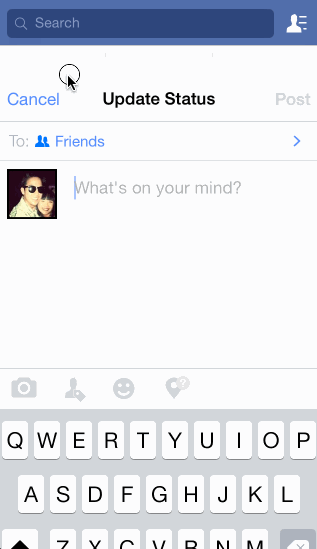

# ios-for-designers-2-facebook Demo

This is an iOS demo application for displaying a tab bar controller with several views.

Time spent: 4 hours spent in total

Completed user stories:
 * [x] Required: Loading the app shows the facebook icon
 * [x] Required: The first page shows a tab bar with 5 tabs
 * [x] Required: Each tab shows a view
 * [x] Required: Tapping on Thrillist opens up the detailed page
 * [ ] Required: Tapping on like makes it blue
 * [x] Required: Tapping the Status, Photo, or Check In buttons from the feed page should modally present the respective compose view controllers.
 * [x] Required: Tapping cancel on each view controller should dismiss the view controller.
 * [x] Required: User can view a list of latest box office movies including title, cast and tomatoes rating
 * [x] Required: User can click on a movie in the list to bring up a details page with additional information such as synopsis
 * [x] Optional: Placeholder image is used for movie posters loaded in from the network

Walkthrough of all user stories:

GIF created with [LiceCap](http://www.cockos.com/licecap/).
